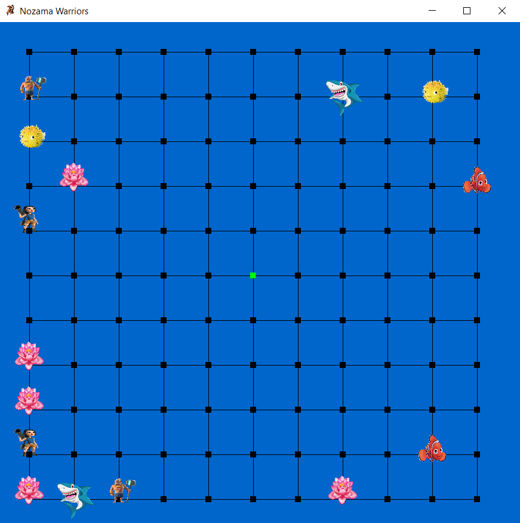

<h1 align='center'>Nozama Warriors</h1>

<p align="center">
This was a multi-thread game to enhance the learning of object-oriented design and programming concepts.
</p>
<p align="center">

</p>

<p align="center">
<a href="./LICENSE">
      
    </a><a href="https://github.com/sabesansathananthan/Nozama_Warriors">
      
    </a><a href="https://twitter.com/intent/tweet?text=Wow,%20I%20used%20Nozama-Warriors.%20That%20is%20excellent.%20Thank%20you%20@TheSabesan">
      
    </a>
</p>

## 🛠️ Built with

- [Java](https://www.java.com/) - a class-based, object-oriented programming language
- [Swing](https://docs.oracle.com/javase/tutorial/uiswing/index.html) - a GUI widget toolkit for Java

## Installation

To setup the app for development on your local machine, please follow the instructions below:

1. Clone the repo to your machine

   ```bash
   git clone https://github.com/sabesansathananthan/Nozama_Warriors.git
   cd Nozama_Warriors
   ```

2. Open your IDE.
